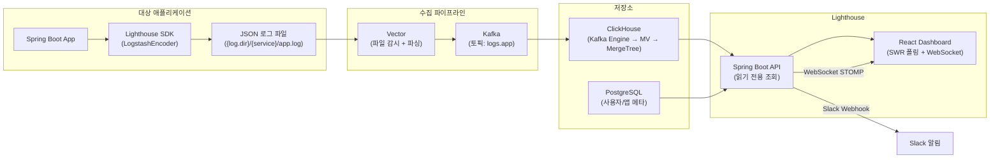
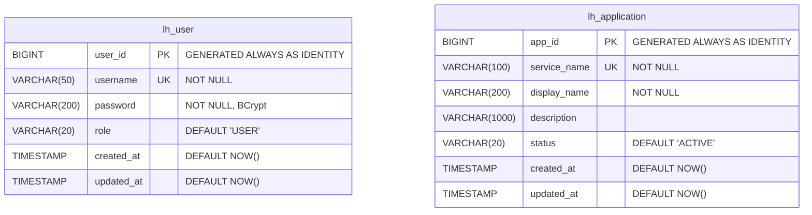
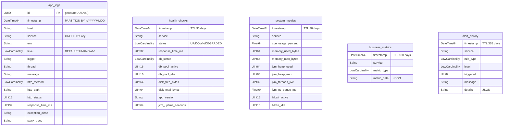

# Lighthouse

분산 애플리케이션의 로그를 실시간으로 수집하고, 저장하고, 시각화하는 **통합 로그 모니터링 플랫폼**입니다.

모니터링 대상 서버에 SDK를 적용하면 구조화된 JSON 로그가 자동 생성되고, Vector → Kafka → ClickHouse 파이프라인을 통해 수집됩니다. 수집된 로그는 커스터마이저블 대시보드 UI에서 실시간으로 검색, 분석, 시각화할 수 있으며, 이상 징후 발생 시 Slack 알림을 자동으로 발송합니다.

> 1인 풀스택 프로젝트로, 요구사항 분석부터 아키텍처 설계, SDK 개발, 백엔드/프론트엔드 구현, Docker 기반 배포까지 전 과정을 직접 수행했습니다.

---

## 주요 기능

- **로그 수집 파이프라인** — SDK(LogstashEncoder) → Vector → Kafka → ClickHouse 자동 적재
- **로그 검색** — 서비스, 레벨, 시간 범위, HTTP 메서드/경로/상태 등 다중 필터 검색
- **대시보드** — 드래그 & 드롭 위젯 기반 커스터마이저블 모니터링 대시보드
- **실시간 알림** — 에러율 급등, 응답시간 초과, 서버 다운 등 5가지 규칙 기반 Slack 알림
- **서버 헬스 모니터링** — Actuator 기반 서버 상태, Uptime, DB Pool 추적
- **시스템 메트릭** — CPU, 메모리, JVM, HikariCP, 스레드 등 Prometheus 메트릭 수집
- **비즈니스 메트릭** — 사용자 활동, 트랜잭션 등 비즈니스 KPI 수집 및 시각화
- **애플리케이션 자동 발견** — ClickHouse 로그 기반 신규 서비스 자동 등록 (5분 주기)
- **JWT 인증** — AccessToken/RefreshToken 기반 Stateless 인증

---

## 기술 스택

| 영역 | 기술 |
|------|------|
| **Backend** | Java 17, Spring Boot 4.0.3, Spring Security, Spring WebSocket (STOMP), MyBatis, JdbcTemplate |
| **Frontend** | React 19, MUI 7, Vite 6, SWR, Zustand, zod, ApexCharts, react-grid-layout |
| **SDK** | Spring Boot AutoConfiguration, Logback, LogstashEncoder 8.0 |
| **Database** | ClickHouse 24.8 (로그/메트릭 저장), PostgreSQL 15 (사용자/앱 메타데이터) |
| **Message Queue** | Apache Kafka 3.7 (KRaft 모드) |
| **Log Agent** | Vector 0.38 (파일 감시 → JSON 파싱 → Kafka 전송) |
| **Infra** | Docker Compose, Nginx (리버스 프록시), Multi-stage Dockerfile |
| **Auth** | JWT (JJWT 0.12.5, HS256), BCrypt |
| **API Docs** | SpringDoc OpenAPI 3.0.1 (Swagger UI) |

---

## 시스템 아키텍처



**핵심 설계 결정:** Java에 Kafka Consumer가 없습니다. ClickHouse의 Kafka Engine 테이블이 Materialized View를 통해 Kafka 토픽에서 직접 소비·적재하며, 백엔드는 ClickHouse를 **읽기 전용**으로만 조회합니다.

---

## ERD

### PostgreSQL (메타데이터)



### ClickHouse (로그 및 시계열 데이터)



---

## 프로젝트 구조

```
lighthouse/
├── app/
│   ├── backend/          # Spring Boot API 서버
│   │   ├── src/main/java/com/app/lighthouse/
│   │   │   ├── domain/   # 도메인별 모듈 (auth, log, dashboard, alert, ...)
│   │   │   └── global/   # 공통 인프라 (security, config, exception, ...)
│   │   └── src/main/resources/
│   │       ├── db/migration/    # PostgreSQL Flyway 마이그레이션
│   │       └── db/clickhouse/   # ClickHouse 마이그레이션
│   └── frontend/         # React SPA
│       └── src/
│           ├── sections/  # 기능별 UI 모듈
│           ├── actions/   # SWR 데이터 페칭 훅
│           ├── schemas/   # zod 검증 스키마
│           ├── store/     # Zustand 상태 관리
│           └── auth/      # JWT 인증
├── sdk/
│   └── java/             # lighthouse-spring-boot-starter (로깅 SDK)
├── infra/                # Docker Compose 인프라
│   ├── docker-compose.yml
│   └── vector/           # Vector 설정
└── docs/                 # 설계 문서
```

---

## 시작하기

### 사전 요구사항

- Docker & Docker Compose
- Java 17+
- Node.js 20+

### 1. 인프라 기동

```bash
cd infra
cp .env.example .env
# .env에서 LOG_SOURCE_PATH를 SDK 로그 출력 디렉토리와 동일하게 설정
docker compose up -d    # Kafka, ClickHouse, PostgreSQL 기동
```

### 2. 백엔드 실행

```bash
cd app/backend
cp src/main/resources/application-secrets.yml.example src/main/resources/application-secrets.yml
# application-secrets.yml에서 DB 접속정보, JWT secret 등 설정
./gradlew bootRun
```

### 3. 프론트엔드 실행

```bash
cd app/frontend
cp .env.example .env
# .env에서 VITE_SERVER_URL 설정 (기본: http://localhost:9090)
npm install
npm run dev
```

### 4. SDK 적용 (모니터링 대상 앱)

```bash
cd sdk/java
./gradlew publishToMavenLocal
```

대상 앱의 `build.gradle`에 추가:

```groovy
repositories {
    mavenLocal()
    mavenCentral()
}
dependencies {
    implementation 'com.lighthouse:lighthouse-spring-boot-starter:1.0.0'
}
```

### 전체 Docker 배포 (인프라 + BE + FE 일괄 기동)

```bash
cd infra
docker compose up -d --build
# Kafka(9092) + ClickHouse(8123) + PostgreSQL(5433) + Backend(9090) + Frontend(3030)
```

---

## API 명세

모든 응답은 `ApiResponse<T>` 형태로 래핑됩니다:

```json
{
  "success": true,
  "data": { ... },
  "message": null,
  "timestamp": "2026-03-31T12:00:00"
}
```

### 인증 (`/api/auth`)

| Method | Endpoint | 설명 | 인증 |
|--------|----------|------|------|
| `POST` | `/api/auth/login` | 로그인 → AccessToken + RefreshToken 발급 | 불필요 |
| `POST` | `/api/auth/refresh` | RefreshToken으로 AccessToken 재발급 | 불필요 |

### 애플리케이션 (`/api/applications`)

| Method | Endpoint | 설명 | 파라미터 |
|--------|----------|------|---------|
| `POST` | `/api/applications` | 앱 등록 | `body: { serviceName, displayName, description }` |
| `GET` | `/api/applications` | 앱 목록 조회 | `?status=ACTIVE` (선택) |
| `GET` | `/api/applications/{appId}` | 앱 상세 + 서버 상태 | |
| `PUT` | `/api/applications/{appId}` | 앱 메타 수정 | `body: { displayName, description, status }` |
| `DELETE` | `/api/applications/{appId}` | 앱 삭제 | |
| `POST` | `/api/applications/sync` | ClickHouse → PostgreSQL 동기화 트리거 | |
| `GET` | `/api/applications/{appId}/stats` | 앱 통계 (요청, 에러, 응답시간) | `?from=...&to=...` |

### 로그 (`/api/logs`)

| Method | Endpoint | 설명 | 주요 파라미터 |
|--------|----------|------|-------------|
| `GET` | `/api/logs` | 로그 검색 | `?service, level, from, to, keyword, http_method, http_path, http_status, page, size, sort` |
| `GET` | `/api/logs/{id}` | 로그 상세 (UUID) | |
| `GET` | `/api/logs/timeline` | 로그 볼륨 타임라인 | `?from, to, interval(1m/5m/15m/1h/1d), service, env` |

### 대시보드 (`/api/dashboard`)

| Method | Endpoint | 설명 | 주요 파라미터 |
|--------|----------|------|-------------|
| `GET` | `/api/dashboard/summary` | 요약 지표 (총 요청, 에러, 평균 응답시간) | `?from, to, service` |
| `GET` | `/api/dashboard/timeseries` | 시계열 버킷 (요청, 에러, 응답시간) | `?from, to, intervalMin, service` |
| `GET` | `/api/dashboard/request-volume` | 시간대별 요청량 | `?from, to, intervalMin` |
| `GET` | `/api/dashboard/response-time` | 응답시간 추이 (P95, P99) | `?from, to, intervalMin` |
| `GET` | `/api/dashboard/slow-apis` | 느린 API 랭킹 (Top N) | `?from, to, limit, service` |
| `GET` | `/api/dashboard/error-logs` | HTTP 에러 로그 | `?from, to, limit, service` |

### 헬스 모니터 (`/api/health-monitor`)

| Method | Endpoint | 설명 | 주요 파라미터 |
|--------|----------|------|-------------|
| `GET` | `/api/health-monitor/status` | 현재 헬스 상태 (UP/DOWN/DEGRADED) | `?service` |
| `GET` | `/api/health-monitor/history` | 헬스 상태 이력 | `?service, from, to` |
| `GET` | `/api/health-monitor/uptime` | Uptime 비율 | `?service, days` |

### 시스템 메트릭 (`/api/metrics`)

| Method | Endpoint | 설명 | 주요 파라미터 |
|--------|----------|------|-------------|
| `GET` | `/api/metrics/system` | 최신 시스템 메트릭 (CPU, 메모리, GC, 풀) | `?service` |
| `GET` | `/api/metrics/trend` | 시스템 메트릭 추이 | `?service, from, to, intervalMin` |

### 비즈니스 메트릭 (`/api/business`)

| Method | Endpoint | 설명 | 주요 파라미터 |
|--------|----------|------|-------------|
| `GET` | `/api/business/summary` | 비즈니스 KPI 요약 | `?service` |
| `GET` | `/api/business/users` | 사용자 활동 타임라인 | `?service, from, to` |
| `GET` | `/api/business/shorts` | 숏폼 콘텐츠 통계 | `?service, from, to` |

### 알림 이력 (`/api/alerts`)

| Method | Endpoint | 설명 | 주요 파라미터 |
|--------|----------|------|-------------|
| `GET` | `/api/alerts/history` | 알림 이력 (페이지네이션) | `?from, to, ruleType, level, page, size` |

---

## 담당 역할

**1인 풀스택 개발** — 기획부터 배포까지 전 과정을 단독으로 수행했습니다.

| 단계 | 수행 내용 |
|------|----------|
| **요구사항 분석** | 분산 애플리케이션 환경에서 로그 모니터링의 필요성을 정의하고, 실시간 수집 → 저장 → 시각화 → 알림의 전체 흐름을 설계 |
| **아키텍처 설계** | SDK → Vector → Kafka → ClickHouse → Spring Boot → React 파이프라인 설계. ClickHouse Kafka Engine을 활용한 Consumer-less 아키텍처 채택, 이중 DB(PostgreSQL + ClickHouse) 전략 수립 |
| **SDK 개발** | Spring Boot AutoConfiguration 기반 로깅 SDK 설계 및 구현. 대상 앱에 의존성 한 줄 추가만으로 구조화 로그 자동 생성 |
| **백엔드 개발** | 8개 도메인 API(인증, 로그, 대시보드, 헬스, 메트릭, 비즈니스, 알림, 애플리케이션), 5개 스케줄러, 5개 알림 규칙, WebSocket 실시간 푸시 구현 |
| **프론트엔드 개발** | 커스터마이저블 위젯 대시보드, 로그 검색/필터링, 헬스/메트릭/비즈니스/알림 모니터링 화면 구현. SWR + Zustand + zod 기반 데이터 아키텍처 설계 |
| **인프라 구축** | Docker Compose로 Kafka, ClickHouse, PostgreSQL, Vector 통합 환경 구성. Multi-stage Dockerfile로 BE/FE 컨테이너화, Nginx 리버스 프록시 설정 |
| **운영 고려** | 알림 쿨다운, 데이터 TTL, 로그 로테이션, Graceful 장애 복구(서버 헬스 체크 + 프론트 폴백 UI) 등 운영 안정성 확보 |

---

## 트러블슈팅

### 1. Oracle → PostgreSQL 전환

| 항목 | 내용 |
|------|------|
| **문제** | 개발/배포 환경에서 Oracle Free Docker 이미지가 약 1.2GB 메모리를 점유하여 리소스 부담이 컸음 |
| **원인** | Oracle은 엔터프라이즈 DB로, 최소 구동에도 대량의 메모리가 필요한 구조 |
| **해결** | PostgreSQL 15 Alpine으로 전환. DDL 문법 변환(NUMBER→BIGINT, VARCHAR2→VARCHAR, SYSTIMESTAMP→NOW()), Flyway 마이그레이션 재작성, MyBatis XML 네임스페이스 변경 |
| **결과** | 메모리 사용량 **1.2GB → ~50MB**로 절감. Docker 이미지 크기도 대폭 감소하여 CI/CD 속도 개선 |

### 2. ClickHouse ORDER BY 키 컬럼 변경 불가

| 항목 | 내용 |
|------|------|
| **문제** | `ingest_time` 컬럼을 `timestamp`로 이름 변경하려 했으나 `ALTER TABLE RENAME COLUMN` 실패 |
| **원인** | ClickHouse에서 ORDER BY / PARTITION BY 키에 포함된 컬럼은 RENAME이 불가능한 제약이 있음 |
| **해결** | 새 스키마로 임시 테이블 생성 → `INSERT INTO ... SELECT`로 데이터 이관 → 기존 테이블 DROP → 임시 테이블 RENAME 전략 적용. Kafka Engine 테이블과 Materialized View도 순서대로 재생성 |
| **결과** | 무손실 마이그레이션 완료. ClickHouse 컬럼형 DB의 내부 제약사항을 학습하고, 안전한 스키마 변경 패턴을 확립 |

### 3. ClickHouse 집계 함수 NaN → getLong 에러

| 항목 | 내용 |
|------|------|
| **문제** | 모니터링 대상 서버 미기동 시 `AlertScheduler`에서 `ArithmeticException` (NaN을 Long으로 변환 불가) 발생 |
| **원인** | ClickHouse의 `avg()` 함수는 데이터가 없을 때 `0`이 아닌 `NaN`을 반환하며, JDBC `getLong()`이 이를 처리하지 못함 |
| **해결** | `count()` 선행 쿼리로 데이터 존재 여부를 먼저 확인하고, SQL에서 `ifNotFinite(avg(value), 0)`으로 NaN을 0으로 대체 |
| **결과** | 대상 서버 미기동 상태에서도 안정적으로 동작. RDBMS와 다른 ClickHouse 집계 함수의 엣지케이스를 방어 |

### 4. Docker 빌드 시 Cross-Platform ESLint 에러

| 항목 | 내용 |
|------|------|
| **문제** | 로컬(Windows)에서는 정상 빌드되지만, Docker(Linux) 환경에서 `vite-plugin-checker`의 ESLint 검사가 실패 |
| **원인** | `eslint-import-resolver-alias`가 Linux 환경에서 경로 해석에 실패. OS별 파일 시스템 경로 처리 차이 |
| **해결** | `VITE_SKIP_CHECKER` 환경변수를 도입하여 프로덕션 빌드 시 checker 플러그인을 선택적으로 비활성화. Dockerfile에서 `VITE_SKIP_CHECKER=1` 설정 |
| **결과** | 로컬 개발 시에는 실시간 ESLint 체크가 유지되고, Docker 프로덕션 빌드는 안정적으로 통과 |

### 5. Vector 인프라 분리 (아키텍처 경계 재설계)

| 항목 | 내용 |
|------|------|
| **문제** | Vector가 Lighthouse의 docker-compose에 포함되어 있었으나, 실제로는 대상 애플리케이션 측에서 로그 파일을 관리하는 구조 |
| **원인** | 초기 설계에서 모든 컴포넌트를 하나의 docker-compose에 배치했으나, Vector는 로그 **생성 측**에 배치되어야 파일 감시가 가능 |
| **해결** | Vector를 대상 앱 인프라로 이관하고, Lighthouse docker-compose에서 제거. 컨테이너 6개 → 5개로 경량화 |
| **결과** | 컴포넌트 간 책임 경계가 명확해짐. Lighthouse는 Kafka 이후(수집·저장·조회)만 담당하는 깔끔한 아키텍처 확립 |
