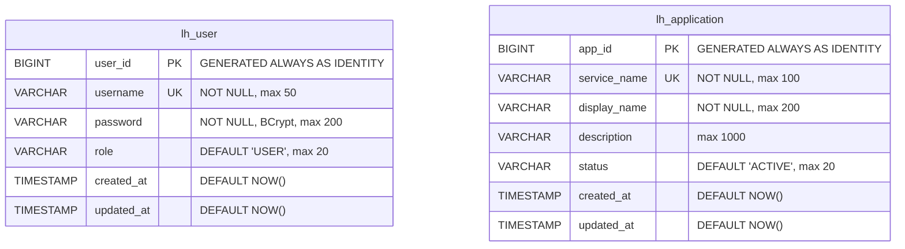
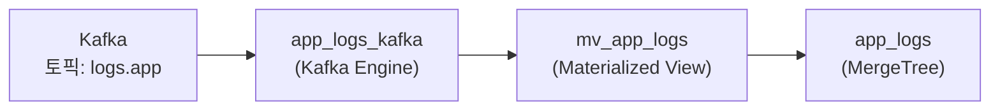
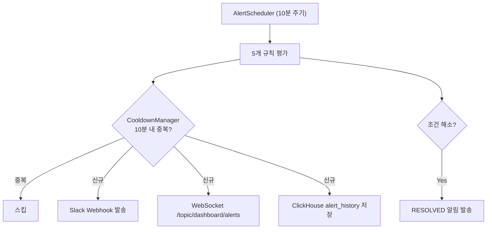

# Lighthouse Backend

Lighthouse 플랫폼의 **백엔드 API 서버**입니다. ClickHouse에 저장된 로그와 메트릭을 조회하는 REST API를 제공하고, 모니터링 대상 서버의 헬스·메트릭·비즈니스 데이터를 주기적으로 수집하며, 이상 징후 발생 시 Slack 알림을 발송합니다.

---

## 기술 스택

| 항목 | 기술 | 선택 이유 |
|------|------|----------|
| **Language** | Java 17 | LTS 지원, Record/Sealed Class 등 최신 문법 활용 |
| **Framework** | Spring Boot 4.0.3 | WebSocket, Security, Scheduling 통합 지원 |
| **ORM (PostgreSQL)** | MyBatis 4.0.1 | XML 매퍼 기반 SQL 직접 제어, 복잡한 쿼리 대응 |
| **Query (ClickHouse)** | JdbcTemplate | 분석 쿼리 최적화를 위한 Raw SQL 직접 작성 |
| **Auth** | JJWT 0.12.5 (HS256) | Stateless JWT, AccessToken + RefreshToken 이중 토큰 |
| **DB (메타데이터)** | PostgreSQL 15 | 사용자/앱 레지스트리 (Source of Truth) |
| **DB (로그)** | ClickHouse 24.8 | 시계열 로그 대량 저장 및 실시간 집계 |
| **Migration** | Flyway (PG) + Custom Runner (CH) | 각 DB에 맞는 마이그레이션 전략 |
| **WebSocket** | STOMP over SockJS | 대시보드 실시간 알림 푸시 |
| **API Docs** | SpringDoc OpenAPI 3.0.1 | Swagger UI 자동 생성 |

---

## 디렉토리 구조

```
src/main/java/com/app/lighthouse/
├── domain/
│   ├── alert/              # 알림 시스템 (규칙, 스케줄러, 쿨다운, Slack)
│   │   ├── controller/     # AlertHistoryController
│   │   ├── service/        # AlertScheduler, AlertHistoryService
│   │   ├── rule/           # 5개 AlertRule 구현체
│   │   ├── repository/     # AlertHistoryRepository (ClickHouse)
│   │   └── dto/            # AlertHistoryPageDto, AlertNotificationDto
│   ├── application/        # 애플리케이션 관리 + 자동 발견
│   ├── auth/               # JWT 인증 (로그인/리프레시)
│   ├── business/           # 비즈니스 메트릭 수집/조회
│   ├── dashboard/          # 대시보드 집계 API
│   ├── health/             # 헬스 체크 + Uptime
│   ├── log/                # 로그 검색/상세/타임라인
│   └── metric/             # 시스템 메트릭 수집/조회
├── global/
│   ├── config/             # DataSource, Security, WebSocket, Swagger, Flyway
│   ├── exception/          # GlobalExceptionHandler
│   ├── init/               # AdminAccountInitializer
│   ├── response/           # ApiResponse<T> 래퍼
│   ├── security/           # JwtTokenProvider, JwtAuthenticationFilter
│   ├── util/               # TimeUtils, PrometheusTextParser
│   └── websocket/          # DashboardNotificationService
└── LighthouseApplication.java

src/main/resources/
├── application.yml                     # 비민감 설정
├── application-secrets.yml.example     # 민감정보 템플릿
├── db/migration/                       # PostgreSQL Flyway 마이그레이션
│   ├── V1__create_user_table.sql
│   └── V2__create_application_table.sql
├── db/clickhouse/                      # ClickHouse 마이그레이션
│   ├── V1__create_app_logs_table.sql
│   ├── V2__create_kafka_pipeline.sql
│   ├── V3__remove_logs_raw_pipeline.sql
│   ├── V4__rename_ingest_time_to_timestamp.sql
│   ├── V5__add_uuid_id_column.sql
│   ├── V6__create_health_checks_table.sql
│   ├── V7__create_system_metrics_table.sql
│   ├── V8__create_business_metrics_table.sql
│   └── V9__create_alert_history_table.sql
└── mapper/oracle/                      # MyBatis XML 매퍼
    ├── UserMapper.xml
    └── ApplicationMapper.xml
```

---

## 실행 방법

### 사전 요구사항

- Java 17+
- 인프라 기동 (Kafka, ClickHouse, PostgreSQL) — `infra/` 참조

### 설정

```bash
# 1. 민감정보 파일 생성
cp src/main/resources/application-secrets.yml.example src/main/resources/application-secrets.yml

# 2. application-secrets.yml 편집
#    - PostgreSQL 접속정보 (jdbc-url, username, password)
#    - ClickHouse 접속정보
#    - JWT secret (256비트 이상)
#    - 관리자 초기 계정
#    - CORS/WebSocket origins
#    - Slack webhook URL (알림 사용 시)
```

### 빌드 및 실행

```bash
./gradlew build          # 빌드 + 테스트
./gradlew bootRun        # 애플리케이션 실행 (기본 포트: 9090)
./gradlew test           # 전체 테스트
./gradlew test --tests "com.app.lighthouse.SomeTest"  # 특정 테스트
./gradlew clean build    # 클린 빌드
```

### 주요 환경변수

| 변수 | 기본값 | 설명 |
|------|--------|------|
| `INIT_ADMIN_ENABLED` | `true` | 부팅 시 관리자 계정 자동 생성 |
| `ALERT_ENABLED` | `false` | 알림 시스템 활성화 여부 |
| `PICOOK_BASE_URL` | `http://localhost:8080` | 모니터링 대상 서버 주소 |

---

## DB 스키마

### 이중 DB 설계

- **PostgreSQL** — 사용자 계정(`lh_user`)과 애플리케이션 레지스트리(`lh_application`)의 원장. MyBatis로 접근
- **ClickHouse** — 로그(`app_logs`), 헬스(`health_checks`), 메트릭(`system_metrics`), 비즈니스(`business_metrics`), 알림 이력(`alert_history`) 저장. `@Qualifier("clickHouseJdbcTemplate")`으로 접근

**크로스 DB 트랜잭션 금지** — Oracle 쓰기와 ClickHouse 조회를 하나의 트랜잭션 경계 안에 섞지 않습니다.

### PostgreSQL 테이블



### ClickHouse 테이블

| 테이블 | 엔진 | ORDER BY | PARTITION BY | TTL |
|--------|------|----------|-------------|-----|
| `app_logs` | MergeTree | (service, level, timestamp, host) | toYYYYMMDD(timestamp) | — |
| `app_logs_kafka` | Kafka | — | — | — |
| `health_checks` | MergeTree | (service, timestamp) | toYYYYMMDD(timestamp) | 90일 |
| `system_metrics` | MergeTree | (service, timestamp) | toYYYYMMDD(timestamp) | 30일 |
| `business_metrics` | MergeTree | (service, metric_type, timestamp) | toYYYYMMDD(timestamp) | 180일 |
| `alert_history` | MergeTree | (service, rule_type, timestamp) | toYYYYMMDD(timestamp) | 365일 |

#### Kafka → ClickHouse 자동 적재 구조



---

## API 엔드포인트 상세

### 인증 API

```
POST /api/auth/login
  Body: { "username": "string", "password": "string" }
  Response: { "accessToken": "string", "refreshToken": "string" }

POST /api/auth/refresh
  Body: { "refreshToken": "string" }
  Response: { "accessToken": "string", "refreshToken": "string" }
```

### 애플리케이션 API

```
POST   /api/applications                    # 앱 등록
GET    /api/applications                    # 앱 목록 (?status=ACTIVE)
GET    /api/applications/{appId}            # 앱 상세 + 서버 상태
PUT    /api/applications/{appId}            # 앱 수정
DELETE /api/applications/{appId}            # 앱 삭제
POST   /api/applications/sync              # CH→PG 동기화
GET    /api/applications/{appId}/stats      # 앱 통계 (?from, ?to)
```

### 로그 API

```
GET /api/logs
  Params: service, level, from, to, keyword, http_method, http_path,
          http_status, page(default=0), size(default=50), sort
  Response: { content[], totalElements, page, size, totalPages }

GET /api/logs/{id}          # UUID로 로그 상세 조회
GET /api/logs/timeline      # 로그 볼륨 타임라인 (?from, ?to, ?interval, ?service, ?env)
```

### 대시보드 API

```
GET /api/dashboard/summary          # 요약 (총 요청, 에러, 평균 응답시간)
GET /api/dashboard/timeseries       # 시계열 버킷
GET /api/dashboard/request-volume   # 시간대별 요청량
GET /api/dashboard/response-time    # P95/P99 응답시간
GET /api/dashboard/slow-apis        # 느린 API 랭킹 (Top N)
GET /api/dashboard/error-logs       # HTTP 에러 로그
  공통 Params: from(필수), to(필수), intervalMin 또는 limit, service(선택)
```

### 헬스/메트릭/비즈니스/알림 API

```
GET /api/health-monitor/status      # 현재 상태 (?service)
GET /api/health-monitor/history     # 이력 (?service, ?from, ?to)
GET /api/health-monitor/uptime      # Uptime % (?service, ?days)

GET /api/metrics/system             # 최신 메트릭 (?service)
GET /api/metrics/trend              # 메트릭 추이 (?service, ?from, ?to, ?intervalMin)

GET /api/business/summary           # KPI 요약 (?service)
GET /api/business/users             # 사용자 활동 (?service, ?from, ?to)
GET /api/business/shorts            # 숏폼 통계 (?service, ?from, ?to)

GET /api/alerts/history             # 알림 이력 (?from, ?to, ?ruleType, ?level, ?page, ?size)
```

---

## 스케줄러 시스템

5개 스케줄러가 `fixedDelay` 방식으로 독립 실행됩니다 (이전 작업 완료 후 대기 시간).

| 스케줄러 | 기본 주기 | 설정 키 | 역할 |
|---------|----------|---------|------|
| **ApplicationSyncScheduler** | 5분 | `app.sync.interval-ms` | ClickHouse에서 최근 24시간 내 활성 서비스를 스캔하여 PostgreSQL에 자동 등록 |
| **AlertScheduler** | 10분 | `lighthouse.alert.check-interval-ms` | 5개 알림 규칙 평가 → Slack 발송 + WebSocket 브로드캐스트 + 이력 저장 |
| **HealthCheckScheduler** | 60초 | `lighthouse.health.check-interval-ms` | 대상 서버 `/actuator/health` 프로브 → ClickHouse 적재 + WebSocket 알림 |
| **MetricCollectorScheduler** | 60초 | `lighthouse.metric.collect-interval-ms` | `/actuator/prometheus` 스크래핑 → ClickHouse 적재 |
| **BusinessCollectorScheduler** | 5분 | `lighthouse.business.collect-interval-ms` | 비즈니스 API 엔드포인트 호출 → KPI 데이터 ClickHouse 적재 |

---

## 알림 시스템

### 5가지 알림 규칙

| 규칙 | 타입 | 임계치 | 레벨 |
|------|------|--------|------|
| **ErrorRateAlertRule** | ERROR_RATE | 최근 10분 에러율 > 기준선 × 3.0배 (폴백: 절대값 5%) | CRITICAL |
| **ResponseTimeAlertRule** | RESPONSE_TIME | P95 응답시간 > 3000ms (최소 50건 이상) | WARNING/CRITICAL |
| **ApiFailureAlertRule** | API_FAILURE | 동일 엔드포인트 연속 5회 5xx 응답 | WARNING |
| **ServerDownAlertRule** | SERVER_DOWN | 연속 3회 헬스체크 실패 | CRITICAL |
| **ResourceThresholdAlertRule** | RESOURCE_THRESHOLD | CPU 80%/95%, 메모리 85%/95%, 디스크 여유 10% 미만, HikariCP 80% | WARNING/CRITICAL |

### 알림 흐름



---

## WebSocket

| 토픽 | 메시지 | 트리거 |
|------|--------|--------|
| `/topic/dashboard` | OverviewSummaryDto | 대시보드 데이터 갱신 시 |
| `/topic/dashboard/alerts` | AlertNotificationDto (level, ruleType, details) | 알림 발생/해소 시 |
| `/topic/dashboard/health` | HealthChangeDto (service, previousStatus, currentStatus) | 헬스 상태 변경 시 |
| `/topic/dashboard/metrics` | MetricAlertDto (service, metric, value) | 메트릭 임계치 초과 시 |

**연결:** `ws://localhost:9090/ws` (SockJS fallback 지원)

---

## 설정 파일 가이드

### application.yml (비민감 설정)

- 서버 포트, 데이터소스 드라이버/풀 설정
- 알림 규칙 임계치, 스케줄러 주기
- 모니터링 대상 서버 경로 (Actuator, Prometheus, 비즈니스 API)
- 로깅 레벨

### application-secrets.yml (민감 설정, .gitignore)

- PostgreSQL/ClickHouse JDBC URL, username, password
- JWT secret (256비트 이상), 토큰 만료시간
- 관리자 초기 계정
- CORS/WebSocket 허용 origins
- Slack Webhook URL

> `application.yml`에 크리덴셜이나 내부 IP를 직접 쓰지 않습니다. 환경변수 기본값(`:` 뒤)에도 실제 값을 넣지 않습니다.
