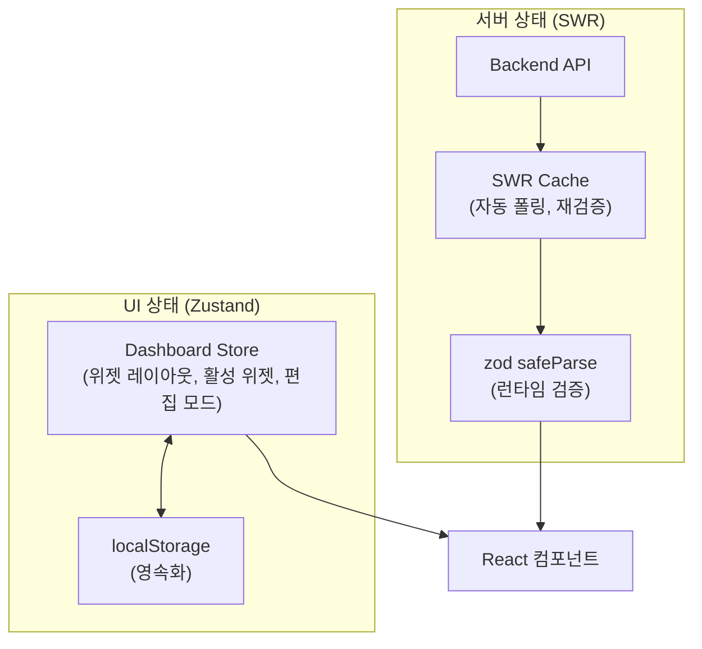
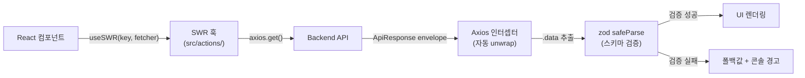

# Lighthouse Frontend

Lighthouse 플랫폼의 **프론트엔드 SPA**입니다. 커스터마이저블 대시보드를 중심으로 로그 검색, 서버 헬스, 시스템 메트릭, 비즈니스 KPI, 알림 이력을 시각화합니다.

---

## 기술 스택

| 항목 | 기술 | 선택 이유 |
|------|------|----------|
| **UI Framework** | React 19 | 최신 Concurrent Features 활용 |
| **UI Library** | MUI 7, MUI X DataGrid | 일관된 디자인 시스템 + 고성능 데이터 테이블 |
| **Build Tool** | Vite 6 | 빠른 HMR, ESM 기반 번들링 |
| **Server State** | SWR 2 | 자동 폴링, 캐시, 재검증 |
| **UI State** | Zustand 5 | 경량 상태 관리, localStorage 영속화 |
| **Validation** | zod 3 | API 응답 런타임 검증 + 타입 안전성 |
| **Charts** | ApexCharts 4 | 시계열 차트, 반응형 지원 |
| **Layout** | react-grid-layout | 드래그 & 드롭 대시보드 위젯 그리드 |
| **HTTP** | Axios | 인터셉터 기반 인증/에러 처리 |
| **Forms** | React Hook Form + zod resolver | 선언적 폼 검증 |
| **i18n** | i18next | 다국어 지원 (UI 한국어 기본) |
| **Date** | Day.js | KST 타임존 처리 |

---

## 디렉토리 구조

```
src/
├── sections/              # 기능별 UI 모듈 (각 모듈에 view/ 폴더 포함)
│   ├── overview/          # 대시보드 (요약 카드, 차트, 테이블)
│   ├── health/            # 서버 헬스 모니터링
│   ├── metrics/           # 시스템 메트릭 (CPU, 메모리, JVM)
│   ├── business/          # 비즈니스 KPI
│   ├── alerts/            # 알림 이력
│   ├── logs/              # 로그 검색 + 상세
│   ├── server-instances/  # 서버 인스턴스 관리
│   ├── user/              # 사용자 관리
│   ├── account/           # 계정 설정
│   └── error/             # 에러 페이지 (403, 404, 500)
├── pages/                 # sections/*/view/를 import하는 얇은 래퍼
├── routes/                # 라우트 정의 (paths.js + sections/*.jsx)
├── actions/               # SWR 데이터 페칭 훅
│   ├── overview.js        # 대시보드 데이터 (summary, volume, responseTime, slowApis, errorLogs)
│   ├── logs.js            # 로그 검색
│   ├── health.js          # 헬스 상태/이력/업타임
│   ├── metrics.js         # 시스템 메트릭/추이
│   ├── business.js        # 비즈니스 KPI
│   └── alerts.js          # 알림 이력
├── schemas/               # zod 검증 스키마 (도메인별 분리)
│   ├── overview.js        # overviewSummarySchema, requestVolumeSchema, ...
│   ├── health.js          # healthStatusSchema, uptimeSchema
│   ├── metrics.js         # systemMetricSchema, metricTrendSchema
│   ├── business.js        # businessSummarySchema, userActivitySchema
│   ├── logs.js            # logSearchResponseSchema
│   └── alerts.js          # alertHistoryPageSchema
├── store/                 # Zustand 스토어
│   └── use-dashboard-store.js  # 위젯 레이아웃/활성 상태 (localStorage 영속화)
├── lib/
│   └── axios.js           # Axios 인스턴스 (인터셉터, 엔드포인트 상수, fetcher)
├── auth/                  # JWT 인증 (Provider, Guard, Context)
├── context/               # ServerHealthProvider (API 헬스 모니터링)
├── hooks/                 # useMonitoringTokens (디자인 토큰)
├── components/            # 재사용 UI 컴포넌트
├── layouts/               # 레이아웃 셸 (Dashboard, Auth, Account)
├── theme/                 # MUI 테마 커스터마이징
├── utils/                 # 유틸리티 (format-time, format-number, format-duration)
└── locales/               # i18n 설정
```

---

## 실행 방법

### 사전 요구사항

- Node.js 20+
- 백엔드 서버 기동 (기본: `http://localhost:9090`)

### 설치 및 실행

```bash
cp .env.example .env
# .env에서 VITE_SERVER_URL 설정 (기본: http://localhost:9090)

npm install
npm run dev        # 개발 서버 (Vite HMR)
```

### 빌드 및 검증

```bash
npm run lint       # ESLint 정적 분석 (필수)
npm run build      # 프로덕션 빌드 (필수 — 모듈 resolve 검증)
npm run lint:fix   # 린트 자동 수정
npm run fm:fix     # Prettier 포맷팅
```

---

## 페이지 구성

### 대시보드 라우트 (`/dashboard`)

| 경로 | 페이지 | 설명 |
|------|--------|------|
| `/` | Overview | 커스터마이저블 위젯 대시보드 (메인 화면) |
| `/health` | Health | 서버 헬스 상태 + Uptime |
| `/metrics` | Metrics | CPU/메모리/JVM/HikariCP 시계열 차트 |
| `/business` | Business | 비즈니스 KPI (사용자 활동, 숏폼 통계) |
| `/alerts` | Alerts | 알림 이력 목록 + 필터 |
| `/logs` | Logs | 로그 검색 (다중 필터) |
| `/logs/:id` | Log Detail | 로그 상세 (스택트레이스 포함) |
| `/server-instances` | Server List | 서버 인스턴스 목록 |
| `/server-instances/:id` | Server Detail | 서버 상세 정보 |
| `/user/*` | User | 사용자 관리 (목록, 생성, 수정, 프로필) |
| `/user/account/*` | Account | 계정 설정 (일반, 알림, 비밀번호 변경) |

### 인증 라우트 (`/auth`)

| 경로 | 페이지 |
|------|--------|
| `/jwt/sign-in` | 로그인 |
| `/jwt/sign-up` | 회원가입 |

### 에러 페이지

| 경로 | 페이지 |
|------|--------|
| `/403` | 접근 권한 없음 |
| `/404` | 페이지 없음 |
| `/500` | 서버 에러 |

---

## 상태 관리 아키텍처

서버 상태와 UI 상태를 명확히 분리합니다.



| 영역 | 도구 | 저장 대상 |
|------|------|----------|
| **서버 상태** | SWR (`src/actions/`) | API 응답 데이터 (로그, 메트릭, 알림 등) |
| **UI 상태** | Zustand (`src/store/`) | 대시보드 레이아웃, 위젯 활성/비활성, 편집 모드 |
| **인증 상태** | React Context (`src/auth/`) | JWT 토큰, 사용자 정보, 인증 여부 |
| **서버 헬스** | React Context (`src/context/`) | API 서버 연결 상태 (healthy/unhealthy) |

**규칙:**
- 컴포넌트에서 axios 직접 호출 금지 → `src/actions/`의 SWR 훅만 사용
- Zustand에 서버 데이터 저장 금지 → 캐시 중복/불일치 방지
- 모든 API 응답은 zod `safeParse`로 검증 후 UI에 전달

---

## 대시보드 위젯 시스템

### 기본 위젯 구성 (10개)

| 위치 | 위젯 | 크기 (lg) |
|------|------|----------|
| 상단 행 | 총 요청수, 에러율, 평균 응답시간, P95 응답시간 | 각 3×2 |
| 2행 | 로그 볼륨 차트 (8×4) + 서버 상태 (4×4) | |
| 3행 | 에러 추이 차트 (8×4) + 로그 레벨 분포 (4×4) | |
| 4행 | API 랭킹 테이블 (6×4) + 최근 에러 로그 (6×4) | |

### 커스터마이징 기능

- **드래그 & 드롭**: `react-grid-layout`으로 위젯 위치/크기 자유 조정
- **위젯 추가/제거**: 활성 위젯 목록에서 토글
- **레이아웃 영속화**: `localStorage`에 자동 저장 (새로고침 후에도 유지)
- **반응형 그리드**: lg(12열), md(12열), sm(6열) 브레이크포인트
- **기본값 복원**: 원클릭 리셋

---

## 데이터 흐름



### 에러 처리 흐름

| 상황 | 처리 |
|------|------|
| **401 Unauthorized** | Axios 인터셉터 → JWT 토큰 제거 → 로그인 페이지 리다이렉트 |
| **네트워크 에러** | `SERVER_DOWN_EVENT` 발행 → `ServerHealthProvider`가 15초 폴링으로 전환 → `ServiceUnavailableView` 표시 |
| **4xx 에러** | 해당 화면에서 사용자 친화적 메시지 표시 |
| **zod 검증 실패** | 콘솔 경고 + 빈 배열/null 폴백값 반환 (UI 크래시 방지) |
