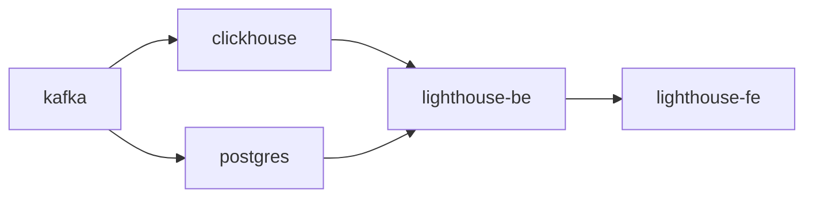
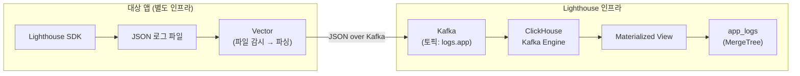

# Lighthouse Infrastructure

Lighthouse 플랫폼의 **Docker Compose 기반 인프라 환경**입니다. 메시지 큐(Kafka), 로그 저장소(ClickHouse), 메타데이터 DB(PostgreSQL), 백엔드, 프론트엔드를 컨테이너로 통합 관리합니다.

---

## 서비스 구성

| 서비스 | 이미지 | 포트 | 역할 |
|--------|--------|------|------|
| **kafka** | apache/kafka:3.7.0 | 9092 (내부), 9094 (외부) | KRaft 모드 메시지 브로커. `logs.app` 토픽으로 로그 수신 |
| **clickhouse** | clickhouse-server:24.8 | 8123 (HTTP), 9000 (Native) | 로그/메트릭/알림 이력 저장 및 실시간 집계 엔진 |
| **postgres** | postgres:15-alpine | 5433 → 5432 | 사용자 계정, 애플리케이션 레지스트리 (메타데이터) |
| **lighthouse-be** | (자체 빌드) | 9090 | Spring Boot API 서버 |
| **lighthouse-fe** | (자체 빌드) | 3030 | React SPA (Nginx 서빙) |

### 기동 순서 (depends_on)



---

## 데이터 파이프라인



### Vector 설정 (대상 앱 측 배포)

Vector는 대상 애플리케이션 인프라에서 운영됩니다. 주요 동작:

- **Source** — `{LOG_SOURCE_PATH}/*/app.log` 파일 감시
- **Transform** — JSON 파싱, 필드 매핑 (`@timestamp`→`timestamp`, `logger_name`→`logger`, `thread_name`→`thread`), 타입 변환 (`http_status`/`response_time_ms` string→int), 환경 메타데이터(`env`) 부착
- **Sink** — Kafka `logs.app` 토픽으로 JSON 전송

---

## 실행 방법

### 1. 환경 설정

```bash
cd infra
cp .env.example .env
```

`.env` 파일을 편집합니다:

```env
# SDK 로그 파일이 출력되는 호스트 경로
LOG_SOURCE_PATH=/path/to/log/directory

# (선택) 외부에서 Kafka에 접속할 호스트 IP
KAFKA_EXTERNAL_HOST=localhost

# (선택) 모니터링 대상 서버 주소
PICOOK_BASE_URL=http://host.docker.internal:8080

# (선택) 알림 시스템 활성화
ALERT_ENABLED=false

# (선택) 부팅 시 관리자 계정 생성
INIT_ADMIN_ENABLED=true
```

### 2. 인프라만 기동

```bash
docker compose up -d kafka clickhouse postgres
```

### 3. 전체 기동 (인프라 + BE + FE)

```bash
docker compose up -d --build
```

5개 컨테이너가 기동됩니다:
- Kafka (9092) + ClickHouse (8123) + PostgreSQL (5433) + Backend (9090) + Frontend (3030)

### 4. 상태 확인

```bash
docker compose ps
docker compose logs -f lighthouse-be    # 백엔드 로그
docker compose logs -f lighthouse-fe    # 프론트엔드 로그
```

---

## 환경변수 가이드

| 변수 | 기본값 | 설명 |
|------|--------|------|
| `LOG_SOURCE_PATH` | — | **(필수)** SDK 로그 파일 출력 디렉토리. Vector가 이 경로를 감시함. SDK의 `log.dir`과 동일해야 함 |
| `KAFKA_EXTERNAL_HOST` | `localhost` | 외부 네트워크에서 Kafka에 접속할 호스트. 원격 Vector 연결 시 서버 IP 설정 |
| `PICOOK_BASE_URL` | `http://host.docker.internal:8080` | 모니터링 대상 서버의 기본 주소 |
| `ALERT_ENABLED` | `false` | 알림 시스템 (Slack 발송, 스케줄러) 활성화 |
| `INIT_ADMIN_ENABLED` | `true` | 부팅 시 관리자 계정 자동 생성 |

### 경로 동기화 (중요)

SDK의 `lighthouse.logging.log-dir`과 인프라의 `LOG_SOURCE_PATH`가 **동일한 디렉토리를 가리켜야** Vector가 로그를 수집할 수 있습니다.

```
SDK (대상 앱)                Infra (.env)
lighthouse.logging.log-dir  →  LOG_SOURCE_PATH
예: /var/log/apps            →  /var/log/apps
```

---

## 볼륨 및 데이터 관리

| 볼륨 | 마운트 경로 | 용도 |
|------|------------|------|
| `clickhouse-data` | `/var/lib/clickhouse` | ClickHouse 데이터 영속화 |
| `postgres-data` | `/var/lib/postgresql/data` | PostgreSQL 데이터 영속화 |

### 데이터 TTL (ClickHouse)

| 테이블 | 보관 기간 |
|--------|----------|
| `app_logs` | 무제한 |
| `system_metrics` | 30일 |
| `health_checks` | 90일 |
| `business_metrics` | 180일 |
| `alert_history` | 365일 |

### 데이터 초기화

```bash
# 전체 초기화 (볼륨 포함 삭제)
docker compose down -v

# 특정 서비스만 재시작
docker compose restart clickhouse
```

---

## Kafka 설정

- **모드:** KRaft (ZooKeeper 불필요)
- **토픽:** `logs.app` (자동 생성)
- **인증:** 없음 (PLAINTEXT)
- **Replication Factor:** 1 (단일 노드)

### ClickHouse Kafka Engine

ClickHouse가 Kafka를 직접 소비합니다 (Java Consumer 없음):

```
app_logs_kafka (Kafka Engine)
  → 토픽: logs.app
  → consumer group: ch_app_logs_consumer
  → 포맷: JSONEachRow

mv_app_logs (Materialized View)
  → parseDateTimeBestEffort(timestamp)
  → generateUUIDv4() AS id
  → INSERT INTO app_logs
```
