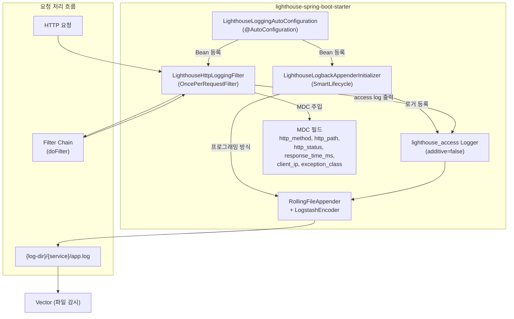

# Lighthouse SDK (Java)

Spring Boot 애플리케이션에 **구조화된 JSON 로깅을 자동 적용**하는 Spring Boot Starter 라이브러리입니다.

의존성 한 줄만 추가하면 LogstashEncoder 기반의 JSON 로그 파일이 자동 생성되고, HTTP 요청/응답 메타데이터(메서드, 경로, 상태코드, 응답시간)가 MDC를 통해 자동 주입됩니다. 생성된 로그는 Vector가 수집하여 Lighthouse 파이프라인으로 전송됩니다.

---

## 기술 스택

| 항목 | 기술 |
|------|------|
| **AutoConfiguration** | Spring Boot AutoConfiguration (`@AutoConfiguration`) |
| **Logging** | Logback + LogstashEncoder 8.0 |
| **Filter** | `OncePerRequestFilter` (HTTP 요청/응답 메타데이터 주입) |
| **Lifecycle** | `SmartLifecycle` (Appender 프로그래밍 방식 등록) |
| **Java** | 17+ |

---

## 연동 가이드

### 1. SDK 빌드 및 배포

```bash
cd sdk/java
./gradlew publishToMavenLocal
```

### 2. 대상 앱에 의존성 추가

```groovy
// build.gradle
repositories {
    mavenLocal()
    mavenCentral()
}

dependencies {
    implementation 'com.lighthouse:lighthouse-spring-boot-starter:1.0.0'
}
```

### 3. 설정 (선택)

기본값으로 바로 동작하며, 필요 시 `application.yml`에서 커스텀 설정합니다:

```yaml
lighthouse:
  logging:
    enabled: true                # 기본값: true (false로 비활성화)
    service-name: my-app         # 미설정 시 spring.application.name 사용
    log-dir: /var/log/apps       # 로그 파일 출력 디렉토리
    file-name: app.log           # 로그 파일명
    max-file-size: 100MB         # 단일 파일 최대 크기
    max-history: 7               # 보관 일수
    total-size-cap: 1GB          # 전체 로그 크기 상한
    http-filter-enabled: true    # HTTP 필터 활성화
    exclude-paths:               # HTTP 로깅 제외 경로
      - /actuator/**
      - /swagger-ui/**
      - /v3/api-docs/**
```

### 4. 로그 확인

앱 기동 후 `{log-dir}/{service-name}/app.log`에 JSON 로그가 한 줄씩 출력됩니다.

---

## 설정 옵션

| 프로퍼티 | 기본값 | 설명 |
|---------|--------|------|
| `lighthouse.logging.enabled` | `true` | SDK 전체 활성화/비활성화 |
| `lighthouse.logging.service-name` | (자동 감지) | 서비스 식별자. 미설정 시 아래 우선순위로 결정 |
| `lighthouse.logging.log-dir` | `/var/log/apps` | 로그 파일 루트 디렉토리 |
| `lighthouse.logging.file-name` | `app.log` | 로그 파일명 |
| `lighthouse.logging.max-file-size` | `100MB` | 로그 파일 로테이션 크기 |
| `lighthouse.logging.max-history` | `7` | 로그 파일 보관 일수 |
| `lighthouse.logging.total-size-cap` | `1GB` | 전체 로그 디스크 사용량 상한 |
| `lighthouse.logging.http-filter-enabled` | `true` | HTTP 요청/응답 메타 자동 주입 |
| `lighthouse.logging.exclude-paths` | (정적 리소스, Actuator 등) | HTTP 로깅 제외 경로 목록 |

### 서비스명 결정 우선순위

1. `lighthouse.logging.service-name` 명시 설정
2. `spring.application.name` 프로퍼티
3. Main 클래스 SimpleName
4. 폴백: `"unknown-app"`

---

## 출력 JSON 구조

```json
{
  "@timestamp": "2026-03-31T12:00:00.000+09:00",
  "level": "INFO",
  "logger_name": "lighthouse_access",
  "thread_name": "http-nio-8080-exec-1",
  "message": "HTTP 200 GET /api/users - 45ms",
  "service": "my-app",
  "host": "server-01",
  "http_method": "GET",
  "http_path": "/api/users",
  "http_status": "200",
  "response_time_ms": "45",
  "client_ip": "192.168.1.100",
  "exception_class": "",
  "stack_trace": ""
}
```

| 필드 | 출처 | 설명 |
|------|------|------|
| `@timestamp` | LogstashEncoder | ISO 8601 타임스탬프 |
| `level` | Logback | 로그 레벨 (INFO, WARN, ERROR 등) |
| `logger_name` | Logback | 로거 이름 (`lighthouse_access`) |
| `thread_name` | Logback | 실행 스레드 |
| `message` | Logback | 로그 메시지 |
| `service` | SDK 설정 | 서비스 식별자 |
| `host` | `InetAddress.getLocalHost()` | 호스트명 |
| `http_method` | HTTP Filter (MDC) | HTTP 메서드 (GET, POST 등) |
| `http_path` | HTTP Filter (MDC) | 요청 경로 |
| `http_status` | HTTP Filter (MDC) | HTTP 응답 상태코드 |
| `response_time_ms` | HTTP Filter (MDC) | 응답 시간 (밀리초) |
| `client_ip` | HTTP Filter (MDC) | 클라이언트 IP (X-Forwarded-For 우선) |
| `exception_class` | HTTP Filter (MDC) | 예외 클래스명 (에러 발생 시) |
| `stack_trace` | LogstashEncoder | 스택트레이스 (에러 발생 시, root cause first, max depth 30) |

---

## 아키텍처



### 핵심 설계 결정

- **ROOT 로거가 아닌 전용 로거(`lighthouse_access`) 사용** — 앱의 일반 로그와 HTTP access 로그를 분리하여 파일에는 access 로그만 기록
- **`additive=false`** — 부모 로거로의 전파를 차단하여 콘솔 중복 출력 방지
- **`SmartLifecycle` 기반 초기화** — Logback이 완전히 초기화된 후 Appender를 프로그래밍 방식으로 등록 (XML 설정 불필요)
- **`compileOnly` 의존성** — Spring Boot를 `compileOnly`로 선언하여 대상 앱의 Spring Boot 버전과 충돌 방지
